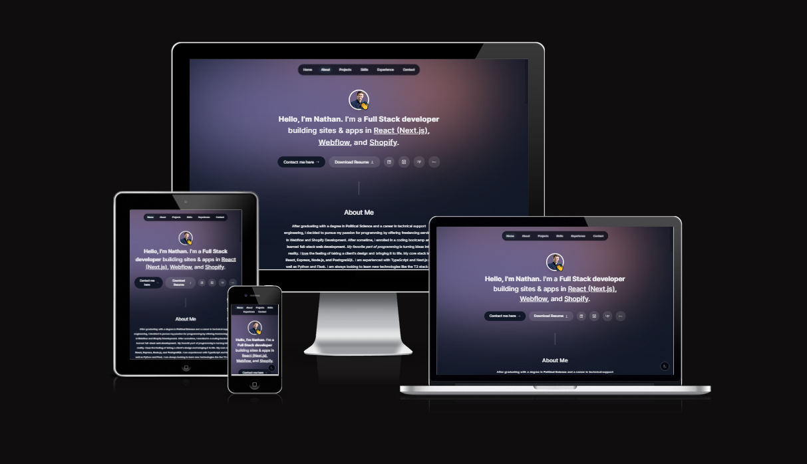

# The Personal Website of Nathan Rydel

<p align="center">
  
</p>

## Technologies Used

[](https://reactjs.org/)
[](https://nextjs.org/)
[](https://tailwindcss.com/)

[](https://www.typescriptlang.org/)

This is a portfolio site built using React, Next.js, TypeScript, Tailwind CSS.

## Setup a local copy

To run this project locally, follow these steps:

1. Clone the repository:

```bash
git clone https://github.com/nathanrydel/nextjs-portfolio.git
```

2. Navigate to the project directory:
```bash
cd your-repository
```

3. Install dependencies:
```bash
npm install
```

4. Start the development server:
```bash
npm run dev
```

5. Open your browser and visit `http://localhost:4000` to view the app.

6. Build:
To build the project for production, run:

```bash
npm run build
```

This will create an optimized build of your app in the dist directory.